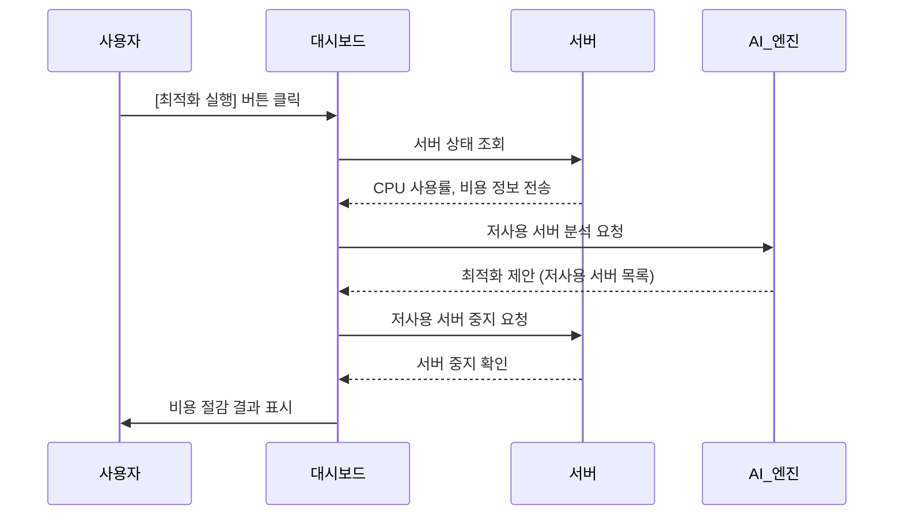

# 클라우드 비용 최적화를 위한 시뮬레이터

클라우드 비용 최적화를 위한 시뮬레이터
서버를 자동으로 감지하고 비용 절감 기회를 시각적으로 보여줍니다.


## 개발 배경 및 필요성

- **클라우드 비용 과다 지출 문제**: 기업들이 클라우드 서비스를 도입하면서 사용하지 않는 리소스에 대한 비용이 과도하게 발생하는 문제가 대두되고 있습니다.
- **수동 모니터링의 한계**: 기존의 수동 모니터링 방식으로는 실시간으로 변화하는 리소스 사용량을 효율적으로 관리하기 어렵습니다.
- **비전문가의 접근성**: 클라우드 비용 최적화에 대한 전문 지식이 없는 사용자도 쉽게 이해하고 활용할 수 있는 도구의 필요성이 증가하고 있습니다.
- **AI 기반 자동화 필요**: 인공지능을 활용한 자동화된 분석 및 최적화 솔루션이 필요한 시점입니다.
- 
## 주요 기능

- 실시간 서버 모니터링 (CPU 사용률, 비용)
- AI 기반 비용 최적화 제안
- 월별 비용 절감액 시각화
- 다크 모드 UI

## 시스템 요구사항

- Python 3.7 이상
- Tkinter 라이브러리

## 실행 방법

1. 저장소를 클론합니다.
2. 다음 명령어로 애플리케이션을 실행합니다:
   ```bash
   python main.py
   ```

## 시퀀스 다이어그램


## 기대효과

- **비용 절감**: 사용하지 않는 리소스를 자동으로 감지하고 최적화하여 월 평균 20-30%의 클라우드 비용 절감이 기대됩니다.
- **인적 자원 효율화**: 수동 모니터링에 소요되던 인력과 시간을 절약하여 핵심 업무에 집중할 수 있습니다.
- **사용 편의성**: 직관적인 대시보드를 통해 복잡한 클라우드 비용 구조를 쉽게 이해하고 관리할 수 있습니다.
- **확장성**: 다양한 클라우드 서비스 공급자와의 연동이 가능한 유연한 아키텍처를 제공합니다.
- **데이터 기반 의사결정**: 상세한 분석 보고서를 통해 효율적인 리소스 할당에 대한 의사결정을 지원합니다.


